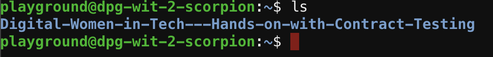
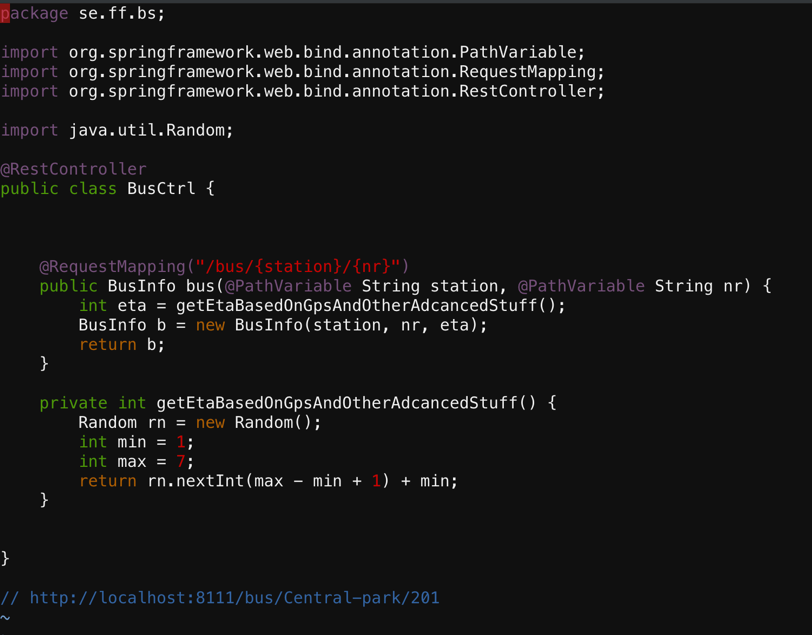
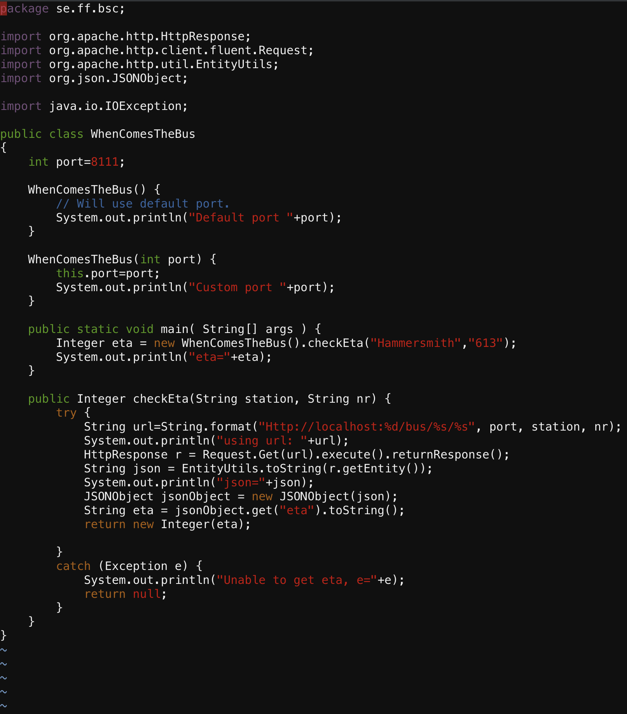
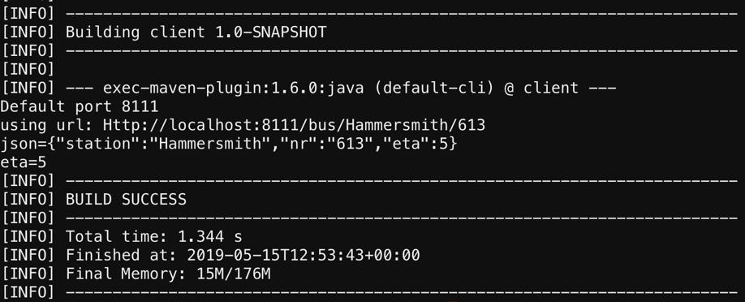
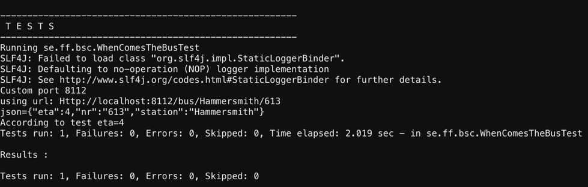
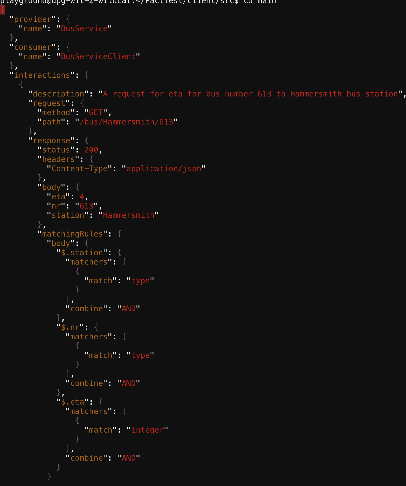
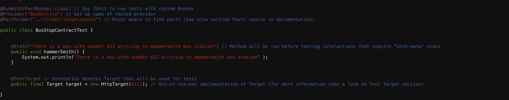
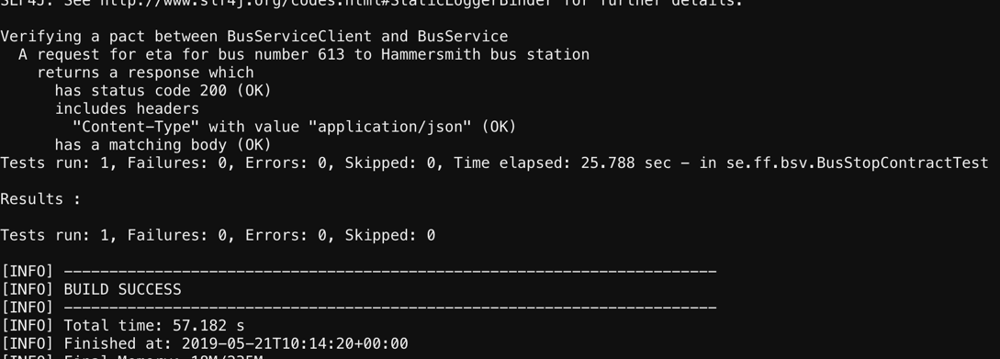
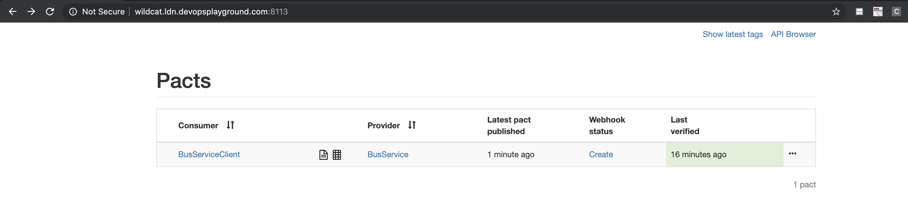
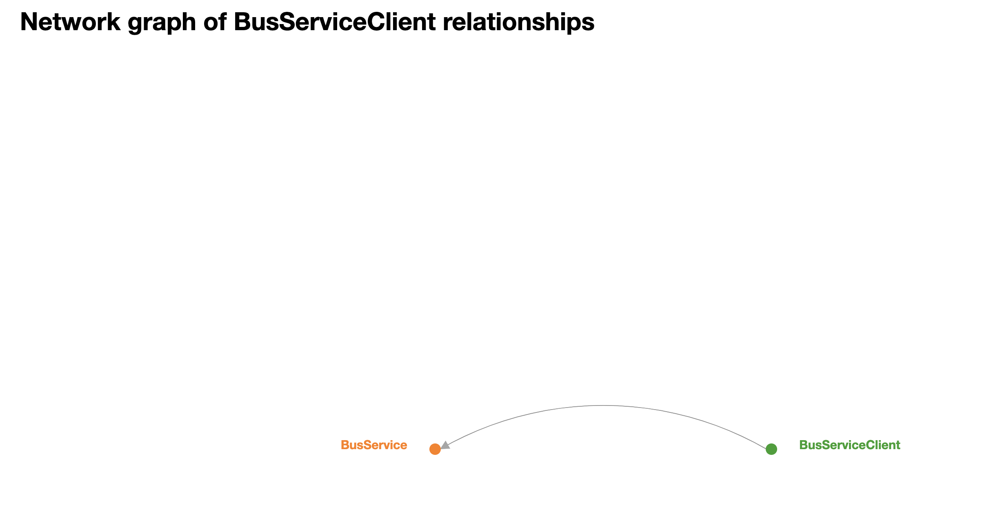

## **DevOps Playground: Hands on with Contract Testing using Pact**
 

# **Introduction**
On this meetup, we will walk you through what Contract testing. We will explain how PACT works and do a hands-on workshop creating a pact between two micro services and testing it.

Name: Samer Naqvi  

Role: Continuous Delivery Consultant

Email: Samer.Naqvi@ecs-digital.co.uk

LinkedIn: [Let's connect](https://www.linkedin.com/in/samer-naqvi-8b27a3/)

# **Requirements** 

•	Jdk 

•	Code editor (e.g. Eclipse, Vi) basic knowledge

•	Git

•	Maven

•	Chrome or any other browser

•	Basic Java knowledge

•	Basic Linux cli knowledge

# **Setup** 
The remote machine will have all the programs you need to follow this session. On a new tab, please open Remote Machine to launch the login screen to connect to the test machines. For any technical assistance, please ask around for help.
If you wish to use your own machine on this playground, please make sure you have all the applications and/or programs listed on the requirements and clone or download this repository.

# **Further Reading** 
•	[Official Pact Documentation](https://docs.pact.io/)

•	[Contract Tests vs Functional Tests](https://docs.pact.io/best_practices/consumer/contract_tests_not_functional_tests)

•	[Getting started with Pact and Consumer Driven Contract Testing](https://dius.com.au/2016/02/03/microservices-pact/)

•	[Pact jvm consumer junit](https://github.com/DiUS/pact-jvm/tree/master/pact-jvm-consumer-junit)

•	[Pact Broker](https://github.com/pact-foundation/pact-broker-docker)

# **Survey Link** 
We would love to hear your feedback and make improvements on the way we deliver our playground session. Please click the [survey](https://qabook.typeform.com/to/SFjrAQ) to participate.


# **Pact Project** 
Once you are successfully logged in to your instance, follow the steps below to open the project.

1. To ensure the pact project is present check the directory contents by running:
    ```
    ls
    ``` 



2. The following variables are already set in your instance with set paths. 

  - BUSAPP= **PactTest/bs/src/main/java/se/ff/bs** 

  - BUSSPRINGBOOT=**PactTest/bs**  

  - BUSCOMES=**PactTest/client/src/main/java/se/ff/bsc** 

  - BUSTEST=**PactTest/client/src/test/java/se/ff/bsc** 

  - CLIENT=**PactTest/client**  

  - BROKER=**PactTest/dockerpactbroker** 

  - VERIFY=**PactTest/verifyer/src/test/java/se/ff/bsv** 


3. Lets view the spring boot class that will run our live system which gives an estimated bus arrival time. 
    ```
    cd $BUSAPP
    ``` 

4. Type or copy/paste 
    ```
    vi BusCtrl.java
    ``` 
5. The above step will open the class BusCtrl.java in vi terminal, which will look like this. 



This is the bus application (spring boot) that has a controller, BusCtrl. This service takes station and bus number as input variables and then it uses the method getEtaBasedOnGpsAndOtherAdancedStuff(). This method returns an integer which then creates a BusInfo object with station number and the time left.  
6. To exit the vi editor and return to the current directory use:
 ```
    :q
 ```

This will take you back to your present working directory.  

7. Use the below command to go to the Bus Application main directory 
```
    cd $BUSSPRINGBOOT
 ```
8. Now lets start the spring boot service by giving the below command
```
    mvn spring-boot:run
 ``` 
9. Go to browser/new tab and type **http:// address of your instance:8111/bus/Central_station/60**    

# **Class WhenComesTheBus.java (Client)**  
We can now write our client side test.    
10. Open a new tab in your browser and enter address of your linux instance again and log in.  
11.	Let's view our client side class in vi editor 
```
    vi $BUSCOMES/WhenComesTheBus.java
 ```  
The class WhenComesTheBus.java will open in the vi editor.  

 

This class uses port 8111 as default port. It has the method checkEta() that checks estimated time for the station Hammersmith and bus number 613. It than prints out the results. CheckEta() method looks at local host, port, station and the bus number. It than makes an HTTP request and transform it into json and extract the integer from the result.  

12. To exit the vi editor and return to the current directory use:
 ```
    :q
 ``` 
13.To go to client directory to run the client test use:
```
    cd $CLIENT
 ``` 
14.Let’s run the class WhenComesTheBus.java by typing the command 
```
    mvn exec:java -Dexec.mainClass=se.ff.bsc.WhenComesTheBus
 ``` 
15.The class should run and give you the result as below:  

 

# **Pact Test WhenComesTheBusTest.java**
Ok let’s now create the pact file.  The test that we are going to write is based on an example I picked from pact-jvm.    
16.	Now let’s write our test class WhenComesTheBusTest.java. I have already created a shell class for that. 
```
    vi $BUSTEST/WhenComesTheBusTest.java
```   
17.	You should now see an empty class **WhenComesTheBusTest.java**. Copy the code below and paste it in the vi editor inside the main class. (**Press i to make vi in edit mode**).   
In the code below  we add the pact rule to represent our provider. The hostname and port are optional. If left out, it will default to 127.0.0.1 and a random available port. You can get the URL and port from the pact provider rule.
 We are using Port 8112 which will create a mock service. And when we run the pact verification method, doTest(), the mock service will get populated with the information that we setup in the Pact annotated method. 

```java
@Rule
public PactProviderRuleMk2 provider = new PactProviderRuleMk2("BusService", "localhost", 8112, this);

@Pact(consumer = "BusServiceClient")
public RequestResponsePact createPact(PactDslWithProvider builder) {
    Map<String, String> headers = new HashMap();
    headers.put("Content-Type", "application/json");


    DslPart etaResults = new PactDslJsonBody()
            .stringType("station","Hammersmith")
            .stringType("nr","613")
            .integerType("eta",4)
            .asBody();

    RequestResponsePact result =  builder
            .given("There is a bus with number 613 arriving to Hammersmith bus station")
            .uponReceiving("A request for eta for bus number 613 to Hammersmith bus station")
            .path("/bus/Hammersmith/613")
            .method("GET")
            .willRespondWith()
            .status(200)
            .headers(headers)
            .body(etaResults).toPact();

    return result;
}

   @Test
@PactVerification()
  public void doTest() {
System.setProperty("pact.rootDir","../pacts");  // Change output dir for generated pact-files
        Integer eta = new WhenComesTheBus(provider.getPort()).checkEta("Hammersmith", "613");
        System.out.println("According to test eta="+eta);
        assertTrue(eta >= 0);
    }
```

In the above code, once the **@PactVerification()** method is run, the mock service will get populated with the information that is setup in the **@Pact** annotated method. In that method we declare the **PactDslJsonBody()**, where we say that we are depending on a string type named ‘station’, string type named ‘nr’ and a integer type named ‘eta’. These are the things that we need from the consumer. We also say that the status should be 200 and the header should be what we have given in **headers.put("Content-Type", "application/json")**.
In the **@PactVerification()** method, we first set the root directory for the pact file to be created in. In the next step than we use the class WhenComesTheBus at the provider port, which means that it won’t use the live application data but the mock/virtual data. Than the method **checkEta** is called with station name and bus number.  
18.	Save the above code by typing  
```
    :wq
 ``` 
19.	To run the testcase WhenComesTheBusTest.java we need to going back to client directory.       
```
    cd $CLIENT
 ``` 
20.	Type the maven run command below 

```
   mvn test
 ``` 
  

21.	By running the above pact test will create a json pact file in the location **/client/target/pacts**.  
22.	To view the pact file type the command **vi BusServiceClient-BusService.json**. 

```
   vi target/pacts/BusServiceClient-BusService.json
 ``` 

#**Pact File**    

23.	By entering the command in the above step, you will see the json pact file in vi editor.  

  
You can see in the above json file that it is a pact between provider **BusService** and a consumer **BusServiceClient**. It contains the description, request method, path, the response and the body. A bit further down there are the **matchingRules**, which verifies that the station and nr matches type and the eta should be of type integer. We have also **providerStates**, which can be used for a test on the provider side.  

24.	To exit the vi editor and return to the current directory use:
 ```
    :q
 ```   
  
#**BusStopContractTest(Provider)**
  
We run BusStroContractTest.java class to verify that our live system works according to the client specification/contract that is created.  

25.	To view the provier class type:
```
   vi $VERIFY/BusStopContractTest.java
 ``` 
  

It contains a **@State("There is a bus with number 613 arriving to Hammersmith bus station")**, which is given in the **WhenComesTheBus.java** class. This state was also given in the pact file as Provider state. The **@state** annotation is given in test to ensure for example to insert something in the database or other things to be in place for this test to work.  I have kept this test simple hence nothing is being inserted in this test and the state is just given as a statement. But if this state is removed entirely from this class, it will fail since in the contract we have given the provider to be in the state of  “There is a bus with number 613 arriving to Hammersmith bus station”.  
**@TestTarget** annotation targets the system to be tested. In the above example we are pointing it to port that the live system is running on. This test also needs to have access to the pact file in order for it to verify in the annotation @PactFolder("../client/target/pacts"). It is also necessary for it to be given the same name in @Provider("BusService") that is in the pact file for the provider.  
Let run this test now.  

26.  Let’s go to main directory verify i.e. **/verifier**.  
27.  To run the provider test use:

```
   mvn test
 ``` 

The result should look like below.



#**Pact Broker**   

We will be using a docker pact broker. I have used an existing pack broker. Lets start the pack broker which is on a docker compose     
28.	Type **cd $BROKER**.  
29.	This folder contains the file **docker-compose.yml** file. Type in **docker-compose up**.  
30.	Open a separate tab on your browser and copy paste your linux instance address **<Linus instance address>:8113** which should open up your docker compose like below:  
  
  
30.	Currently your pack broker does not have your pact file. So let’s publish the pact file onto the pact broker. For this we need to go to the client folder. Type:

 ```
   cd $CLIENT
 ``` 

31.	Let’s publish the pact file by giving the command 

```
   mvn pact:publish
 ``` 
32.	Go to the tab that has your docker compose running and refresh the page. You should now see your pact file on it as below.   
  
31.	You might have noticed that the pact file is not verified on your broker. In order to verify we need to go to be in the **bs** folder, which has the spring boot application. 

```
   cd $BUSSPRINGBOOT
 ``` 
33.	To run the verify the command use:

```
   mvn pact:verify
 ```  
34.	The above command should verify your pact file on your pact broker. Refresh the tab on which your pack broker is running and it should display the last verified time.   
If you click the link **BusServiceClient**, you will be displayed a graphical image of the BusServiceClient relationship with any other service. 

  
